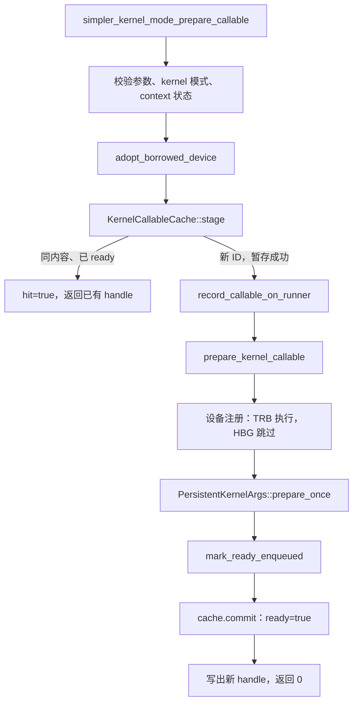

# Kernel 模式 callable 缓存调用链

本文从 `simpler_kernel_mode_prepare_callable` 开始，说明当前缓存实现的上传、注册、
命中、回滚以及 launch 前查询流程。

开发基线是 K2 提交 `48b120b1`（`Add: persistent kernel-context execution resources`），
其父提交 `dc1268cd` 是 K1。分支 `feat/k10a-callable-cache` 直接在该 K2 提交上建立，
K10a 复用 K2 的持久参数块，没有重新实现这部分资源管理。
本文记录当前工作区的同步行为；prepare 的异步改造由 K2 另行推进，本次管理层接口改动不调整同步点。

## 1. 入口与调用总览

入口位于 [onboard C ABI](../../src/common/platform/onboard/host/c_api_shared.cpp)：

```cpp
int simpler_kernel_mode_prepare_callable(
    DeviceContextHandle ctx,
    const void *callable,
    size_t callable_size,
    SimplerCallableHandle *out_handle);
```

`callable` 是完整的、尚未修补设备地址的 `ChipCallable` 序列化镜像，包括 header、
orchestration SO 和子 `CoreCallable`；`callable_size` 是镜像的实际字节数。
此入口不接收 tensor 实参，也不执行计算。调用方不指定 ID：simpler 按内容查重，
为新内容分配 context 内的 ID，连同 generation 写入 `out_handle`。返回值仍然是状态码。
输出指针必须非空，指向独立、可写的 `SimplerCallableHandle`；失败时输出为 `{-1, 0}`。

```cpp
typedef struct SimplerCallableHandle {
    int32_t callable_id;
    uint64_t generation;
} SimplerCallableHandle;
```

```cpp
SimplerCallableHandle handle{-1, 0};
int rc = simpler_kernel_mode_prepare_callable(ctx, callable, size, &handle);
if (rc != 0) return rc;
// handle 仅可用于创建它的 context，生命周期到该 context close 为止。
return simpler_kernel_mode_launch(ctx, handle, args, caller_stream);
```

同内容重复 prepare 返回同一个 handle，不增加注册槽或引用计数；不同内容获得不同 ID。
调用方必须原样保存 ID 和 generation；launch 按值接收完整 handle，不会替调用方刷新 generation。
当前 generation 来自 context 的唯一代次。将来复用槽位时必须发放新代次，不能让旧 handle 再次有效；代次耗尽必须拒绝复用，不能回绕。
当前没有单项释放或换入换出，所有成功返回的 ID 保留到 context close。

调用前必须完成 `simpler_kernel_mode_init`。init 将调用方提供的非零、进程内唯一
`context_generation` 写入缓存，并初始化 context 资源。
prepare 必须在 capture 之外执行；同一 context 的 init、prepare、launch、close
由调用方串行化。缓存自身不加锁，也不查询 capture 状态。



入口先调用 `validate_kernel_prepare_callable_args` 检查输入/输出指针、最小尺寸和对齐，
再确认 context 已归属 kernel 模式且 `accepts_dispatch()` 为真。
`adopt_borrowed_device` 核对借用设备身份，不接管调用方的设备生命周期。

## 2. stage：命中、准入与设备上传

实现位于 [kernel_callable_cache.h](../../src/common/platform/include/host/kernel_callable_cache.h)。
每个 `DeviceRunnerBase` 拥有一份 `kernel_callable_cache_`，不是进程全局缓存。

### 命中与容量判定

`stage` 按以下顺序处理：

1. 检查 generation 和单项字节上限。超大镜像在读取完整内容前就被拒绝。
2. `validate_image` 检查 signature 数量、名称边界、scalar 数量、子项偏移、对齐、
   非重叠布局和镜像末尾，避免后续 hash/upload 越界。
3. `compute_chip_callable_layout` 计算镜像尺寸、完整内容 hash 和 AICore image hash。
4. 按内容查找已准备条目；命中直接返回该条目的 handle，即使容量已经用满也可以命中。
5. 未命中时检查 64 项与累计字节预算；以当前条目数分配下一个 ID，保存 Host 副本并上传代码及设备描述符。

| 情况 | 行为 |
| ---- | ---- |
| 同内容、已 ready | `hit=true`，返回已有 handle；无新分配、H2D 或 runtime 注册 |
| 同内容、尚未 ready | 返回 `INVALID_STATE`，不发布未准备好的 ID |
| 新内容、有容量 | 内部分配新 ID，复制 Host 镜像，取得 arena 内偏移，修补并上传代码 |
| 第 65 份唯一内容 | 返回 `CALLABLE_COUNT_EXCEEDED`；原有内容仍可命中 |
| hash 相同但完整字节不同 | 拒绝，不会仅凭 hash 错误复用代码 |

内容相等要求 hash、长度和 `memcmp` 都匹配，与输入镜像的 Host 指针无关。
调用方反复 prepare 同一份内容，即使传入不同的 Host 副本，也只占一个 ID。

ID 由管理层在 `[0, 64)` 内顺序分配，对外没有指定或覆盖槽位的入口。
暂存失败且尚未发布的尾部 ID 可以回滚，成功发布的 ID 不复用。
唯一镜像按 `align_up(callable_size, 64)` 计费，总代码预算为 512 MiB。
计费包含整个 `ChipCallable` 镜像，不只是 AICore 指令字节；缓存命中不重复计费。

### Host 与 Device 的保存内容

Host 条目保存 residency、内容 hash、不可变镜像的 `shared_ptr`、计费字节数和 `ready`。
`resident_count()` 只统计 ready 项；`resident_bytes()` 包含已暂存但尚未 commit 的代码占用。
`host_bytes()` 统计去重后的镜像字节数，不含容器和 `shared_ptr` 元数据。

首次上传新内容时，通过 `kernel_callable_cache_ops().allocate → mem_alloc_.alloc`，
一次分配 **512 MiB 代码区 + 2 KiB 描述符前缀**。后续 prepare 不扩容。

```text
arena_（底层分配由 MemoryAllocator 持有）
├── 2 KiB：64 × KernelCallableDeviceResidency（每项 32 字节）
│   └── descriptor_address = arena_ + callable_id × 32
└── 512 MiB：按 64 字节对齐、顺序追加的唯一代码镜像
    └── device_address = arena_ + 2048 + 当前 used_
```

上传时先创建临时 `scratch`，调用 `patch_chip_callable_scratch_for_device`，
将子 `CoreCallable::resolved_addr_` 改成设备 binary 地址。
调用方的原始镜像和缓存中的 Host 副本均保持不变。
上传通过 `Ops.copy → rtMemcpy(..., RT_MEMCPY_HOST_TO_DEVICE)` 完成；当前是 prepare 期同步拷贝。

每个新 ID 随后上传自己的
[KernelCallableDeviceResidency](../../src/common/task_interface/kernel_callable_residency.h)，
包含 generation、代码地址、镜像字节数和 callable ID。
此时条目仍为 `ready=false`，`resolve` 不会向 launch 暴露它。

## 3. 接入 runtime 注册与 K2 持久资源

stage 成功且不是内容命中时，入口调用 `record_callable_on_runner`：

```text
record_callable_on_runner
  └─ register_callable_impl                    每种 runtime 各自实现
      └─ upload_and_collect_child_addrs
          └─ HostApi::upload_chip_callable_buffer
              └─ DeviceRunnerBase::upload_chip_callable_buffer
                  └─ kernel 模式：cache.uploaded_address(content_hash)
```

这里函数名仍叫 `upload_chip_callable_buffer`，但 kernel 分支只返回 stage 已上传的地址，
不会再次 malloc 或 H2D。辅助函数据此生成 `func_id → 子 CoreCallable 设备地址` 映射。
program 模式仍使用原来的 `chip_callable_buffers_` 上传与引用计数路径。

`record_callable_on_runner` 将结果存入已有的 `callables_` 表。
该表保存 runtime 调用信息；缓存表负责镜像所有权、容量和驻留状态。

| runtime | Host 记录 | `prepare_kernel_callable` 中的设备注册 |
| ------- | --------- | -------------------------------------- |
| TRB（tensormap_and_ringbuffer） | `register_callable_impl` 提取 orchestration SO 信息；`record_device_orch_callable` 保存地址、大小、符号名、signature 和子 kernel 地址 | `register_callable_on_device` 组装 `RegisterCallableArgs`，在私有 AICPU stream 上发射 `RegisterCallableName`；同步该 stream 后执行 `commit_device_register` |
| HBG（host_build_graph） | 在 Host 上 `dlopen/dlsym` orchestration SO；`record_host_orch_callable` 保存 handle、函数指针、signature 和子 kernel 地址 | 检测到 `host_dlopen_handle` 后直接返回，不执行 AICPU orchestration SO 注册 |

TRB 设备端的 `simpler_aicpu_register_callable` 调用 `load_orch_so`，将 orchestration
入口装入按 ID 索引的表。prepare 中存在 stream 同步，这是当前实现事实，不是 launch 的行为。

注册后继续调用 K2 的 `PersistentKernelArgs::prepare_once`：

- 第一次成功调用分配并初始化 Runtime 设备副本、架构相关资源和设备 `KernelArgs`。
- 后续 callable 复用这些 context 级参数块，不按 ID 再分配一套。
- 持久 Runtime 不在这里绑定为“最近 prepare 的 callable”；具体 invocation 的绑定属于后续 binder。

最后先执行 `mark_ready_enqueued()`，再执行 `cache.commit(callable_id)`，将条目标为 ready；只有此后才向调用方写出新 handle。
**代码已上传、runtime 已记录、context 已就绪和缓存可供 launch 查询，是不同阶段。**

主要源码：
[DeviceRunnerBase](../../src/common/platform/onboard/host/device_runner_base.cpp)、
[上传与子地址收集](../../src/common/task_interface/prepare_callable_common.h)、
[TRB 注册实现](../../src/a2a3/runtime/tensormap_and_ringbuffer/host/runtime_maker.cpp)、
[HBG 注册实现](../../src/a2a3/runtime/host_build_graph/host/runtime_maker.cpp)、
[K2 持久参数](../../src/common/platform/onboard/host/kernel_persistent_args.cpp)。
上面的 runtime 链接以 a2a3 为例，共用 platform 入口也用于 a5 构件。

## 4. 错误、回滚与释放

下表中的错误码名称均带 `PTO_RUNTIME_ERR_` 前缀。

| 失败位置 | 返回与状态处理 |
| -------- | -------------- |
| 唯一内容数量超限 | `CALLABLE_COUNT_EXCEEDED`（-1004）；无缓存修改 |
| 单项或累计代码预算超限 | `CALLABLE_BYTES_EXCEEDED`（-1005）；不上传候选，不破坏已有项 |
| launch handle 代次不匹配 | `CALLABLE_STALE`（-1007）；不上传、不执行、不修改驻留项 |
| 镜像结构非法 | `INTERNAL`（-1000）；完整内容 hash 和上传之前拒绝 |
| 同内容仍在暂存中 | `INVALID_STATE`（-1003）；不返回可供 launch 使用的 ID |
| stage 内分配或拷贝失败 | 移除候选，不增加 `used_`；已分配的整块 arena 可保留供重试 |
| `record_callable_on_runner` 失败 | scope guard 调用 `cache.rollback`，移除尾部候选并退回本项计费；已有 ready 项不受影响 |
| `prepare_kernel_callable` 返回错误或抛异常 | context 进入 Poisoned，候选保持未 ready，地址保留到显式 close；不复用可能已被设备引用的空间 |

回滚只撤销未 commit 的候选，不提供删除 ready 项的接口。kernel 模式也拒绝通过
program 的 `simpler_register_callable` / `simpler_unregister_callable` 绕过缓存管理。

超限由 C ABI 返回分类错误，终止本次 prepare；runtime 不调用 `exit/abort`。
是否退出上层进程由调用方处理返回码后决定。

正常 close 前，调用方必须停止 enqueue、等待 eager/replay 完成并销毁相关 graph。
`finalize_device → runner->finalize → finalize_common_impl` 会清理缓存 Host 元数据，
arena 的设备分配由 `MemoryAllocator` 统一释放。
`KernelCallableCache::clear()` 本身不调用设备 free；fatal abandon 路径遵循原有的设备资源放弃规则。

## 5. prepare 之后：launch 查询与待接入部分

当前 launch 链路为：

```text
simpler_kernel_mode_launch(ctx, handle, args, caller_stream)
  ├─ 校验参数（generation 不得为 0）、kernel 模式和 context 状态
  ├─ cache.resolve(handle, residency)
  │   ├─ 无 ready 项：CALLABLE_NOT_RESIDENT（-1006）
  │   ├─ ID 已驻留但 generation 不匹配：CALLABLE_STALE（-1007）
  │   └─ 成功：返回 ID、generation、代码地址、镜像大小、描述符地址
  └─ binder 尚未实现：返回 INVALID_STATE
```

`resolve` 只读 Host 缓存，无分配、H2D 或懒注册。prepare 成功目前不意味着 kernel launch 已可执行，
`simpler_kernel_mode_supported()` 仍返回 0。

当前不换入、不换出、不复用成功驻留的槽，因此同一 context 的 generation 保持不变。
AICPU 的独立入口 [`simpler_aicpu_kernel_exec`](../../src/common/platform/shared/aicpu/kernel_dispatch.cpp)
已经实现 generation 校验。它与 program 的 `simpler_aicpu_exec` 分开，编入 a2a3/a5、
onboard/sim 的两个 runtime AICPU 库。

设备调用包为 [`SimplerKernelDispatchArgs`](../../src/common/task_interface/kernel_dispatch_args.h)
加紧随其后的 runtime payload，整个包经 CANN launch-args 通道深拷贝：

```text
packet_bytes + residency_address + K9 invocation header + payload
```

`residency_address` 由 binder 从 `cache.resolve(handle)` 的结果填写，指向 prepare 发布的固定槽位描述符。
它不能取自用户 tensor 或 callable 镜像。该分配在所有相关执行结束和 graph 销毁前必须保持有效；
当前入口不能检测已释放的设备地址。CANN 入口只传 `void *`，没有独立的长度参数，
binder 必须保证真实参数分配与 `packet_bytes` 一致；入口检查声明的包长与 payload 长度是否一致。

```text
simpler_aicpu_kernel_exec(packet)
  ├─ 检查包长、mode、ID 范围、非零 generation、参数计数及描述符地址对齐
  │   └─ 非法：InvalidArgs，尚未读取描述符
  ├─ cache_invalidate_range(槽位描述符)
  ├─ 读取当前 KernelCallableDeviceResidency
  │   ├─ ID 不符、未驻留或记录无效：NotResident
  │   └─ generation 不同：Stale
  └─ consume_kernel_invocation(header, resident, payload, bytes)
```

每次调用都读取当前槽位，包括 replay；不会把调用包中的旧 generation 更新为当前值。
拒绝发生在读取 payload、解引用 callable 代码及进入 runtime 消费函数之前。
槽位更新与执行必须外部串行化；未来换出复用时应更新同一描述符位置，不能让旧图指向旧记录的副本。

`KernelDispatchStatus` 是 AICPU entry 的直接返回码，区别于 Host C ABI 的 `-1007`，
也不是 runtime 的 latched error code。非零值通过 CANN 的 entry 失败路径返回；
调用方同步时具体看到的 CANN 错误码仍需上板核验。失败时入口不发起 runtime 工作或内部等待。
binder 的双流完成/错误收敛协议仍由 binder 负责。

**当前连接边界：** Host launch binder 尚未向此入口 enqueue；runtime-specific payload 消费函数
明确返回 `UnsupportedPayload`，不会借 program executor 执行或将未执行报告为成功。
所以设备入口的 generation 校验已实现且有 UT，但完整算子执行和 ACLGraph replay 上板联调尚未完成。

对应测试：

- [缓存单元测试](../../tests/ut/cpp/common/test_kernel_callable_cache.cpp)：数量、字节、对齐、去重、
  上传失败、回滚、子地址修补、Host handle 校验及跨 context 代次。
- [AICPU 入口单元测试](../../tests/ut/cpp/common/test_kernel_dispatch.cpp)：直接编译生产入口 `.cpp`，
  仅替换 cache primitive 和 payload 消费函数；验证非法 ID/零代次先于设备读取被拒、过期代次和错误槽位
  不进入消费函数、合法调用透传消费返回码，以及同一捕获参数在槽位代次更新后的再次调用被拒。
- [生产消费边界测试](../../tests/ut/cpp/common/test_kernel_dispatch_unavailable.cpp)：链接真实入口与当前消费函数，
  验证合法身份返回 `UnsupportedPayload`、旧代次先返回 `Stale`。
- [C ABI 测试](../../tests/ut/py/test_kernel_mode_c_api.py)：真实 prepare 注册、Host handle 校验与生命周期。

AICPU 入口 UT 在 Host CPU 上执行同一份生产代码，不等于真实设备 cache maintenance 或 ACLGraph replay 的上板验收。
