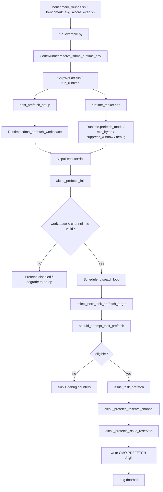

# SDMA 预取路径与 benchmark 指标

本文说明 `sdma` 模式在 a2a3 硬件路径上的设计、关键阈值和 benchmark 指标口径。重点是把 `benchmark_*` 脚本看到的行为，和 runtime / AICPU / STARS SDMA 侧的真实实现对齐起来。

## 1. 目标与范围

这份设计针对当前仓库里的 a2a3 onboard 路径，关注的是：

- benchmark 脚本如何切换 `baseline` / `sdma`
- host 如何准备 provider、stream 和 workspace
- runtime 如何把 prefetch 配置写进 `Runtime`
- AICPU scheduler 如何决定“尝不尝试预取”
- device 侧如何真正写 STARS SDMA CMO PREFETCH SQE

不覆盖：

- a2a3sim 的细节
- STARS 硬件本身的底层协议设计
- benchmark case 自己的算法逻辑

## 2. 模式定义

当前 `PTO_SDMA_PREFETCH_MODE` 解析成 4 种模式：

| 模式 | 数值 | 含义 |
| --- | --- | --- |
| `baseline` | `0` | 关闭 SDMA 预取 |
| `twoslot` | `1` | 关闭 SDMA 预取，保留 two-slot 调度模式 |
| `sdma` | `2` | 启用真实 SDMA 预取 |
| `sdma_fake` | `3` | 不发真实 SDMA，但保留控制路径用于 A/B |

对当前这两份 benchmark 脚本来说，`compare` 实际就是：

1. 跑一遍 `baseline`
2. 跑一遍 `sdma`

两次运行的 workload、case、rounds 保持一致，差异只来自 prefetch 路径。

## 3. 总体路径

### 3.1 一句话概括

`sdma` 模式本质上是在正常调度路径之外，增加了一条“host 预建 STARS channel + AICPU 在 dispatch 邻近点异步发预取”的旁路。

### 3.2 流程示意图



### 3.3 角色分工

| 层次 | 责任 |
| --- | --- |
| benchmark 脚本 | 切换 `baseline` / `sdma`，收集 profiling / device log 指标 |
| `run_example.py` / `CodeRunner` | 拼运行环境，把 provider 相关环境变量带入 runtime |
| host runtime | 建 stream、查 STARS channel、分配 workspace |
| runtime maker | 解析 prefetch env，写入 `Runtime` 配置 |
| AICPU executor | 初始化 prefetch 子系统，在调度点判定是否发预取 |
| device prefetch | 向 STARS SQ 写入 CMO PREFETCH SQE 并敲 doorbell |

## 4. 分阶段设计

### 4.1 benchmark 脚本层

`benchmark_rounds.sh` 和 `benchmark_avg_aicore_exec.sh` 都会对每个 example/case/mode 调 `run_example.py`。

这里的设计重点是：

- `compare` 不在同一次 run 中切模式，而是两次独立运行
- baseline / sdma 共用同一套 case 配置，避免 workload 漂移
- benchmark 只通过环境变量驱动 prefetch，不改业务输入

### 4.2 Python 入口层

`resolve_sdma_runtime_env()` 的行为是：

- 仅在 `platform == a2a3` 时参与
- 单卡场景下，`sdma` 会尝试补齐：
  - `PTO_SDMA_PROVIDER_ROOT`
  - `ASCEND_OPP_PATH`
- `baseline` / `twoslot` / `sdma_fake` 不需要 provider

设计意图很明确：provider 是 `sdma` 的增强依赖，不是 baseline 的公共依赖。

### 4.3 host 侧 setup

`run_runtime()` 在真正 launch AICPU/AICore 前，会调 `host_prefetch_setup(worker_count)`。

其中：

- `PLATFORM_CORES_PER_BLOCKDIM = 3`
- `worker_count = block_dim * 3`
- `PLATFORM_MAX_BLOCKDIM = 24`
- 理论最大 `worker_count = 72`

host setup 做的事是：

1. 检查环境是否允许启用 SDMA prefetch
2. 创建 device-only stream
3. 申请 workspace
4. 通过 `aclnnShmemSdmaStarsQuery*` 把 STARS channel 信息填进 workspace
5. 把 workspace 指针写回 `Runtime::sdma_prefetch_workspace`

如果任一步失败，就返回 `nullptr`，后面自动退化成 no-op。

### 4.4 runtime 配置写入

`runtime_maker.cpp` 会把 prefetch 相关环境变量写进 `Runtime`：

- `prefetch_mode`
- `sdma_prefetch_min_bytes`
- `sdma_prefetch_suppress_window`
- `sdma_prefetch_debug`

这一步的意义是把“是否启用”和“阈值是多少”从 host 传给 AICPU executor，而不是让调度器直接读 host env。

### 4.5 payload 元数据准备

任务提交阶段，每个 `PTO2TaskPayload` 都会准备 3 个关键字段：

- `prefetch_addr`
- `prefetch_issue_bytes`
- `prefetch_filter_bytes`

语义分别是：

- `prefetch_addr`：真正预取的起始地址
- `prefetch_issue_bytes`：本次若发起预取，要推多少字节
- `prefetch_filter_bytes`：用于 eligibility filter 的总可读数据量

设计意图是：把地址和字节数的推导前移到构图/提交阶段，调度热路径只做判断，不做复杂张量解析。

### 4.6 paged attention 专用元数据

`tensor_count == 4` 时会优先走 paged attention 专用逻辑。

核心公式是：

```text
issue_bytes = block_size * head_dim * elem_size
prefetch_addr = cache_base + phys_block * issue_bytes
prefetch_filter_bytes = logical_blocks * issue_bytes
```

这意味着：

- `prefetch_issue_bytes` 反映的是“单个 cache block 的体积”
- `prefetch_filter_bytes` 反映的是“这一类任务整体可读数据规模”

代码注释里直接提到了两个典型量级：

- `16 KB` block prefetch：`paged_attention_unroll` 的 Case2-like
- `32 KB+` block prefetch：`paged_attention_unroll` 的 Case1-like

### 4.7 通用任务元数据

如果不是 paged attention 专用路径，则走 generic 逻辑：

- 只看可读 tensor：`INPUT` / `INOUT` / `NO_DEP`
- 选最大的一个 tensor 作为 `prefetch_addr` 和 `prefetch_issue_bytes`
- 把所有可读 tensor 的总字节数累加成 `prefetch_filter_bytes`

这个策略比较保守，但优点是：

- 不需要理解业务语义
- 可以给大输入张量的任务一个统一的预热路径

### 4.8 AICPU 初始化

`AicpuExecutor::init()` 会把 `Runtime` 里的配置读出来，再调：

```text
aicpu_prefetch_init(runtime->sdma_prefetch_workspace, suppress_window, debug)
```

如果 workspace 无效、channel count 为 0、或 channel info 不完整，就不会进入 enabled 状态。

设计上这里不是 hard fail，而是 graceful degradation。

### 4.9 调度判定点

当前实现不是对“当前 dispatch 的任务”做预取，而是：

- 当前任务的第一个 block 刚 dispatch 完
- 从 batch 里找“下一个任务”作为 prefetch target

也就是一种非常轻量的 look-ahead。

优点是：

- 决策点简单
- 不需要额外扫描 ready queue
- 不会把调度器改成重型预测器

缺点也很直接：

- target 选择仍然偏局部
- 不一定总能选到最值得预取的后继任务

### 4.10 eligibility 规则

`should_attempt_task_prefetch()` 当前必须同时满足：

1. `prefetch_mode == SDMA`
2. `aicpu_prefetch_available() == true`
3. `slot_state.payload != nullptr`
4. 任务 active mask 里包含 AIC 子任务
5. `prefetch_addr != 0`
6. `prefetch_issue_bytes != 0`
7. `prefetch_filter_bytes != 0`
8. `prefetch_filter_bytes >= prefetch_min_bytes`
9. 没被 scheduler-side suppression 挡住

这里最关键的数值门槛是第 8 条，也就是 `prefetch_filter_bytes` 的过滤阈值。

### 4.11 真正 issue 的动作

如果 eligibility 通过，就进入：

1. `aicpu_prefetch_reserve_channel()`
2. `aicpu_prefetch_issue_reserved(addr, size, channel_idx)`

在 device 侧，真正做的事情是：

- 读 channel 的 `sq_head / sq_tail / sq_depth`
- 检查 queue 是否满
- 填一条 `stars_sdma_cmo_sqe_t`
- 更新 `sq_tail`
- 把 suppress window 写回 channel state
- 向 `sq_reg_base + 8` 写 doorbell

这是一条异步旁路，不会阻塞当前 AICore kernel 的执行。

## 5. 具体阈值与默认值

### 5.1 环境变量和默认值

| 配置项 | 默认值 | 当前含义 |
| --- | --- | --- |
| `PTO_SDMA_PREFETCH_MODE` | 未设置时会 fallback 到 legacy env；在当前 benchmark 中显式设为 `baseline` 或 `sdma` | 选择 prefetch 模式 |
| `PTO_SDMA_PREFETCH_MIN_BYTES` | `256 * 1024 = 262144 B` | eligibility filter 的最小总可读字节数 |
| `PTO_SDMA_PREFETCH_SUPPRESS_WINDOW` | `2` | 成功 issue 后，同一 channel 后续要跳过的 eligible attempt 数 |
| `PTO_SDMA_PREFETCH_DEBUG` | `false` | 是否打印更细的 debug counters |
| `PTO_SDMA_PREFETCH_CHANNELS` | 不设时等于 `worker_count = block_dim * 3` | host setup 请求的 channel 数；若设置，则取 `min(env, worker_count)` |
| host workspace size | `16 * 1024 = 16384 B` | STARS channel workspace 大小 |

### 5.2 `min_bytes` 的精确含义

判断条件是：

```text
prefetch_filter_bytes >= prefetch_min_bytes
```

注意这里比的不是 `prefetch_issue_bytes`，而是 `prefetch_filter_bytes`。

这意味着：

- 单次实际 issue 的 block 可以只有 `16 KB`
- 但只要该类任务整体可读数据量达到 `256 KB`，仍然可能通过 filter

举例：

- 如果 `prefetch_issue_bytes = 16 KB`，那至少要 `logical_blocks >= 16`，因为 `16 * 16 KB = 256 KB`
- 如果 `prefetch_issue_bytes = 32 KB`，那至少要 `logical_blocks >= 8`，因为 `8 * 32 KB = 256 KB`

这个设计是为了过滤掉“小任务上的高频小额预取”。

### 5.3 scheduler-side suppression 的具体数值

`get_scheduler_prefetch_suppress_window()` 会按 workload 调整 suppression window，规则如下：

| workload 特征 | 条件 | 实际 suppression window |
| --- | --- | --- |
| paged_attention_unroll，Case2-like | `tensor_count == 4` 且 `scalar_count == 2` 且 `prefetch_issue_bytes <= 16 KB` | `max(base, 7)` |
| paged_attention_unroll，Case1-like | `tensor_count == 4` 且 `scalar_count == 2` 且 `prefetch_issue_bytes > 16 KB` | `max(base, 5)` |
| batch_paged_attention | `tensor_count == 4` 且 `scalar_count == 4 or 6` | `max(base, 7)` |
| generic AIC tasks | 其他情况 | `max(base, 31)` |

这里的 `base` 就是 `PTO_SDMA_PREFETCH_SUPPRESS_WINDOW`，默认是 `2`。

因此默认配置下的真实结果是：

- Case2-like：`7`
- Case1-like：`5`
- batch_paged_attention：`7`
- generic：`31`

也就是说，generic 任务默认是非常稀疏采样的。

### 5.4 device-side suppression 和 queue-full

device 侧还有一层 per-channel suppression：

- 每次成功 issue 后，把 `g_prefetch_channel_suppress_remaining[channel_idx]` 置成 `g_prefetch_suppress_window`
- 默认就是 `2`

另外还有 queue-full 保护：

- 若 `new_tail == sq_head`，说明 SQ 满
- 本次直接跳过
- debug 模式下记到 `queue_full`

这层保护的目的是避免 device 侧把同一个 channel 的 SQ 顶满。

## 6. 当前设计的优势

- A/B 路径干净：`baseline` 和 `sdma` 共享同一套 runtime 和 workload。
- 降级路径完整：provider、workspace、channel、queue 任一步异常，都会退回 no-op。
- 控制开销可见：能分 setup、control path、issue path 分别计时。
- 规则比较保守：`256 KB` filter + `5/7/31` suppression，默认不会对小任务过于激进。
- 实现边界清晰：host 负责建 channel，AICPU 负责决策，device prefetch 负责写 SQE。

## 7. 可能的下一步优化方向

### 7.1 自适应阈值

当前 `262144 B`、`5/7/31` 都是固定规则。下一步可以按 workload 自动调参，例如：

- 根据 `issue_bytes` 自动调 `min_bytes`
- 根据命中收益动态调 suppression

### 7.2 更好的 target selection

现在只看 batch 内邻项，过于局部。后续可以尝试：

- 看 ready queue 里的下一个大任务
- 看 fanout / dependency 更关键的任务
- 看同一 cluster 上更可能立即执行的任务

### 7.3 更细的收益观测

当前统计能看到：

- considered
- eligible
- issue
- suppressed
- queue_full

但还不能直接回答“这次预取到底给后续 kernel 带来了多少收益”。后续可增加：

- prefetch 命中收益近似指标
- issue_bytes 与 exec 改善的相关性
- workload 级别的收益归因

### 7.4 benchmark 口径继续统一

当前 `benchmark_rounds.sh` 已经把 profiling 和 device log 的来源区分开，但两者仍然来自两次独立运行。后续如果需要更强的可比性，可以继续探索：

- 单独保存每次 run 的 mode / rounds / profiling 状态
- 做更严格的结果归档
- 把 per-round device log E2E 和 profiling 样本关联起来

## 8. `benchmark_rounds.sh` 的指标

这个脚本把指标拆成两组：

- profiling 组：固定只跑 1 次，并且带 `--enable-profiling`
- device log 组：使用命令参数 `--rounds` 跑多轮，不带 `--enable-profiling`

因此它关注的是“单次 profiling 视角的跨度”加上“多轮 device log 平均 E2E”：

| 指标 | 含义 | 数据源 |
| --- | --- | --- |
| `AICore Exec` | 所有任务中最早 `start_time_us` 到最晚 `end_time_us` 的跨度 | profiling JSON |
| `AICPU Dispatch->Finish` | 最早 `dispatch_time_us` 到最晚 `finish_time_us` 的跨度 | profiling JSON |
| `Device E2E (profiling)` | profiling 里 task / sched / orch 的最早起点到最晚终点 | profiling JSON |
| `Device E2E Avg (device log)` | device log 里每轮 `orch_start/sched_start` 到 `orch_end/sched_end` 的跨度，最后取均值 | device log |

其中：

- 前三列来自单独的 1 轮 profiling run
- 最后一列来自单独的 non-profiling run，并按 `--rounds` 求平均

它的重点是比较 `baseline` vs `sdma` 的整轮性能差异，不强调预取内部开销拆分。

## 9. `benchmark_avg_aicore_exec.sh` 的指标

这个脚本关注的是“平均单 task AICore 执行时间”和“预取开销”：

| 指标 | 含义 | 数据源 |
| --- | --- | --- |
| `Avg AICore Task Exec` | 所有 task 的 `avg(end_time_us - start_time_us)` | profiling JSON |
| `Prefetch Setup Outcome` | `host_prefetch_setup()` 的结果状态 | run 输出 |
| `Prefetch Ctrl Path Total` | 调度侧预取资格判断/控制路径总耗时 | device log |
| `Prefetch SQE Issue Total` | 真正写 SQE / doorbell 的总耗时 | device log |
| `Prefetch Ctrl Counts` | considered / eligible / 各类 skip 计数 | device log |
| `Prefetch Issue Counts` | attempts / issues / suppressed / queue_full | device log |

它更适合回答两类问题：

- `sdma` 是否把平均单 task 执行时间拉下来了
- `sdma` 的控制开销和 issue 开销是否仍在可接受范围内
